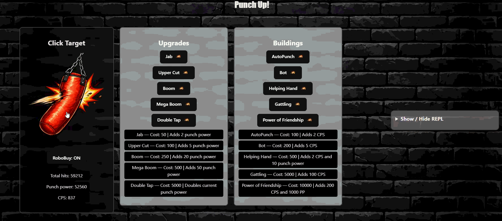

# Clicker

A TypeScript-based incremental game featuring **MVC-style architecture**, **persistent SQL storage**, **account authentication**, **secure password hashing**, and a **Markov-chain-based automated purchasing system**.

---

##  Overview

Clicker is an incremental game where players generate resources, purchase buildings, and unlock upgrades to progressively increase their production.

The project combines traditional game development with several software engineering and data-driven components, including:

* MVC-style application architecture
* Persistent database storage
* User accounts and authentication
* Secure password hashing using PBKDF2
* Parameterized SQL queries
* Automated purchasing behavior
* A Markov-chain model trained on approximately 2 million gameplay sequences

The project was designed to explore both **software architecture** and **data-driven decision making** within an interactive application.



---

##  Features

*  Incremental resource generation
*  Purchasable buildings
*  Upgrade system
*  Persistent game data
*  User account creation and login
*  Secure password storage
*  SQL database integration
*  MVC-style architecture
*  Automated purchasing system
*  Markov-chain-based decision making
*  Model trained using approximately 2 million labeled gameplay sequences

---

##  Tech Stack

| Technology         | Purpose                                       |
| ------------------ | --------------------------------------------- |
| **TypeScript**     | Application and game logic                    |
| **PGlite**         | PostgreSQL database running locally           |
| **SQL**            | Persistent data storage                       |
| **Web Crypto API** | Password hashing and cryptographic operations |
| **PBKDF2**         | Password-based key derivation                 |
| **SHA-256**        | Hashing algorithm used by PBKDF2              |
| **MVC**            | Application architecture                      |
| **Markov Chains**  | Automated purchasing model                    |

---

#  Architecture

The project uses an MVC-style architecture to separate the application's game logic, user interaction, and presentation.

```text
                    ┌──────────────┐
                    │ Game / Model │
                    └──────┬───────┘
                           │
                    ┌──────▼───────┐
                    │  Controller  │
                    └──────┬───────┘
                           │
                    ┌──────▼───────┐
                    │     View     │
                    └──────────────┘


              Account / Authentication
                         │
                         ▼
                  User Game Data
                         │
                         ▼
                   PGlite / SQL


              Automated Purchasing
                         │
                         ▼
                  Markov Chain
```

## Main Components

### `Game`

Responsible for the core game state and gameplay behavior.

### `GameController`

Handles user interactions and coordinates actions between the game and views.

### `GameView`

Responsible for displaying the main game interface.

### `BuildingView`

Displays available buildings and their associated information.

### `UpgradeView`

Handles the presentation and interaction of available upgrades.

### `Account`

Manages user accounts and authentication, including:

* Account creation
* Username validation
* Duplicate account detection
* Login
* Password verification
* Account-related error handling

### `DatabaseHash`

Provides the production password-hashing implementation using the Web Crypto API, PBKDF2, SHA-256, and randomly generated salts.

### `PassHasher`

Defines the password-hashing interface used by the account system.

This allows the account logic to remain independent of the specific hashing implementation.

### `TestHash`

Provides a simplified hashing implementation for testing purposes without relying on the production database hashing implementation.

---

#  Account & Security

Clicker includes an account system designed to securely store and authenticate user credentials.

## Password Security

Passwords are **never stored in plaintext**.

Before a password is stored in the database, it is processed using the Web Crypto API with:

* **PBKDF2** password-based key derivation
* **SHA-256**
* **100,000 iterations**
* A **cryptographically secure random 16-byte salt**
* A **256-bit derived key**

The stored database value contains the salt and derived hash:

```text
salt:derivedHash
```

### Password Creation

```text
Plaintext Password
        │
        ▼
 Generate Random Salt
        │
        ▼
 PBKDF2 + SHA-256
  100,000 iterations
        │
        ▼
  256-bit Hash
        │
        ▼
 salt:hash
        │
        ▼
     Database
```

Each password receives its own randomly generated salt, meaning identical passwords do not produce identical stored values.

## Password Verification

During login:

```text
Entered Password
        │
        ▼
Retrieve Stored Salt
        │
        ▼
PBKDF2 + SHA-256
100,000 iterations
        │
        ▼
Derived Hash
        │
        ▼
Compare With Stored Hash
        │
     ┌──┴──┐
     │     │
   Match  No Match
     │     │
   Login  Reject
```

The stored password itself is never retrieved because only the derived password hash is stored.

---

##  Parameterized SQL

Database operations use parameterized SQL queries rather than directly inserting user-provided values into SQL statements.

For example:

```typescript
await db().query(
    "insert into account(username, password) values($1, $2)",
    [username, passwordHash]
);
```

This separates user input from the SQL statement and helps protect database operations against **SQL injection**.

---

##  Hashing Abstraction

Password hashing is separated behind the `PassHasher` interface:

```text
                 PassHasher
                     │
             ┌───────┴───────┐
             │               │
             ▼               ▼
       DatabaseHash       TestHash
             │               │
             ▼               ▼
     PBKDF2 + SHA-256      SHA-256
       + random salt      for testing
```

The `Account` class depends on the `PassHasher` interface rather than being tightly coupled to a specific hashing implementation.

This provides:

* Separation of concerns
* Easier testing
* Replaceable hashing implementations
* Cleaner authentication logic

The production `DatabaseHash` implementation uses PBKDF2 with a random salt. `TestHash` is intentionally simplified for testing and is **not intended for production password storage**.

---

##  Authentication Error Handling

The account system uses dedicated exceptions for different account and authentication conditions:

```text
AccountAlreadyExistsException
AccountDoesNotExistException
IncorrectPasswordException
InvalidPasswordException
InvalidUsernameException
```

This keeps validation and authentication failures explicit within the application.

---

#  Markov Chain Purchasing Model

One of the main technical components of Clicker is an automated purchasing system based on a **Markov chain**.

Instead of relying entirely on hard-coded purchasing rules, the system uses gameplay data to model purchasing behavior.

## How It Works

Gameplay sequences are used to determine transitions between different purchasing states.

```text
Previous Game State
        │
        ▼
Available Purchases
        │
        ▼
Observed Gameplay Sequences
        │
        ▼
Transition Probabilities
        │
        ▼
   Markov Model
        │
        ▼
Predicted Next Purchase
```

The model uses previous states/actions to estimate the probability of subsequent purchasing decisions.

This allows the automated player to make purchasing decisions based on learned transition patterns.

---

#  Training Data

The purchasing model was trained using approximately:

**2,000,000 labeled gameplay sequences**

The training data is processed to generate transition information for the Markov model.

```text
training.csv
     │
     ▼
Process Gameplay Sequences
     │
     ▼
Identify State Transitions
     │
     ▼
Calculate Transition Information
     │
     ▼
Build Markov Model
     │
     ▼
model.csv
     │
     ▼
Automated Purchasing
```

The resulting model can then be used by the application to determine likely purchasing actions based on the current game state.

---

#  Database & Persistence

Clicker uses **PGlite** and SQL to persist application data.

Database persistence allows game and account information to survive beyond a single application session.

The database is used for storing information such as:

* User accounts
* Password hashes
* Game-related data
* Persistent application state

Database access is separated from the rest of the application to keep persistence concerns independent from the UI and core game logic.

---

#  Testing & Separation of Concerns

The `PassHasher` interface allows the account system to be tested using a separate hashing implementation.

```text
                 Account
                    │
                    ▼
               PassHasher
                    │
             ┌──────┴──────┐
             │             │
             ▼             ▼
        DatabaseHash    TestHash
        Production       Testing
```

This prevents authentication logic from being tightly coupled to the production password-hashing implementation.

It also makes it possible to test account behavior independently.

---

#  Project Structure

```text
Clicker/
│
├── src/
│   ├── Game/
│   │   └── ...
│   │
│   ├── Controller/
│   │   └── ...
│   │
│   ├── View/
│   │   ├── GameView
│   │   ├── BuildingView
│   │   └── UpgradeView
│   │
│   ├── Account/
│   │   ├── account.ts
│   │   ├── database-hash.ts
│   │   ├── pass-hasher.ts
│   │   └── test-hash.ts
│   │
│   └── ...
│
├── training.csv
├── model.csv
├── package.json
└── README.md
```

> The exact directory structure may differ depending on the current version of the project.

---

#  Getting Started

## Prerequisites

* [Node.js](https://nodejs.org/)
* npm

## Installation

Clone the repository:

```bash
git clone <repository-url>
```

Navigate into the project:

```bash
cd Clicker
```

Install dependencies:

```bash
npm install
```

Start the application:

```bash
npm start
```

> Update the commands above if your project's actual `package.json` uses different scripts.

---

#  Environment Variables

Sensitive credentials and configuration should not be committed to the repository.

If the project requires environment variables, create a local environment file based on the provided example:

```text
.env.example
```

Never commit:

```text
.env
.env.local
```

or other files containing passwords, API keys, database credentials, or authentication secrets.

---

#  What I Learned

This project provided experience across several areas of software development.

### Software Architecture

* Applying MVC-style architecture
* Separating models, controllers, and views
* Designing modular application components
* Applying interfaces to reduce coupling

### Database Development

* Working with PostgreSQL-compatible databases
* Using PGlite for persistent application storage
* Writing SQL queries
* Using parameterized queries
* Managing persistent user data

### Authentication & Security

* Implementing account creation and login
* Password hashing and verification
* PBKDF2 key derivation
* Random password salts
* Web Crypto API
* Authentication error handling
* Separating production and testing implementations

### Machine Learning / Data Modeling

* Processing large gameplay datasets
* Working with approximately 2 million labeled sequences
* Modeling state transitions
* Implementing a Markov-chain-based decision system
* Integrating a data-driven model into an interactive application

### TypeScript

* Object-oriented programming
* Interfaces
* Asynchronous programming
* Type safety
* Modular application design

---

#  Future Improvements

Potential improvements include:

* Improve the automated purchasing model
* Compare Markov-chain behavior with alternative purchasing strategies
* Add more sophisticated player behavior models
* Expand the game's progression system
* Add additional account-management functionality
* Add more comprehensive input validation
* Improve authentication and account security features
* Add automated tests for account and gameplay components
* Improve visualization of automated purchasing behavior

---

#  Project Highlights

**Architecture:** MVC-style TypeScript application

**Database:** PGlite / SQL

**Authentication:** Account creation and login

**Password Security:** PBKDF2 + SHA-256 + random 16-byte salts

**Iterations:** 100,000 PBKDF2 iterations

**Automation:** Markov-chain purchasing model

**Training Data:** ~2 million labeled gameplay sequences

**Primary Language:** TypeScript
