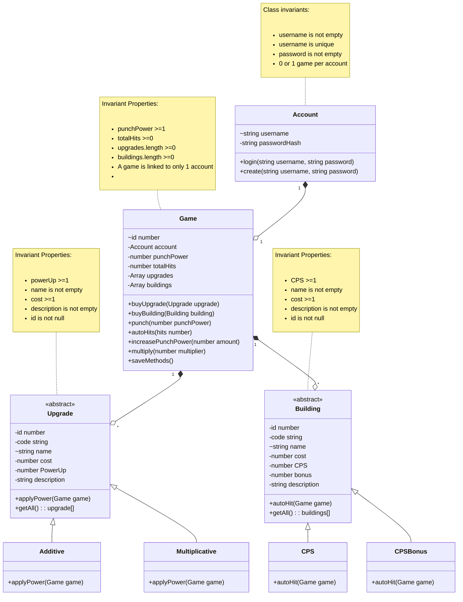

# Domain model

---
**Title** : Domain model for my clicker game 'Punch up' 
**Author**  : Prabhraj Singh Mudharh (mudharps@myumanitoba.ca) - 8012189  
**date** : Winter 2026

---

### Notes
 Domain model is now more granular ( contains more details). Cardinality has been added showing bidirectional relationship wherever neccessary.