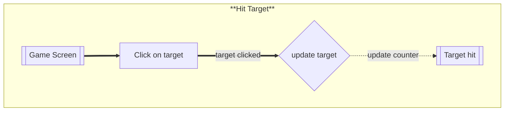
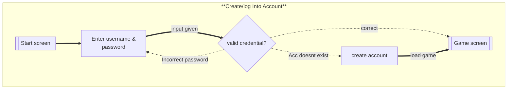
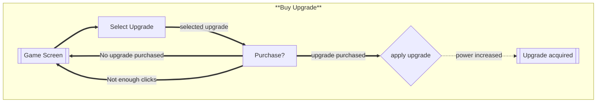
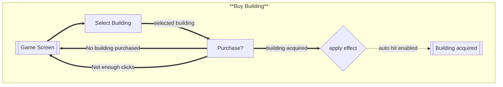

# Flows of Interaction

---
**Title** : Flows of Interactions for my clicker game 'Punch up'(name tbd)  
**Author**  : Prabhraj Singh Mudharh (mudharps@myumanitoba.ca) - 8012189  
**date** : Winter 2026

---
### Hitting the target

This is for when you want to hit the target

### Phase 2

### Log In
This is to log into your account or create one in order to play a game.

### Purchasing an upgrade
This is for when you would want to view and purchase an upgrade
(Game screen is common for both exiting or completing any of the task result in ending up back there)

### Purchase a Building
this is for when you want to purchase a building. This is the same as the upgrade one.

### Notes
Log in task has been shown. Upgrades and buildings now have a cost and the required changes have been reflected in the flows