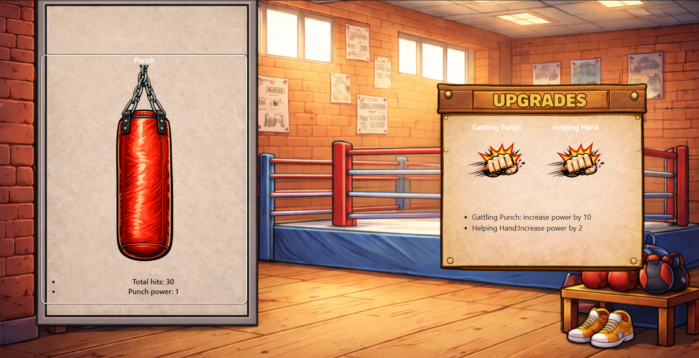
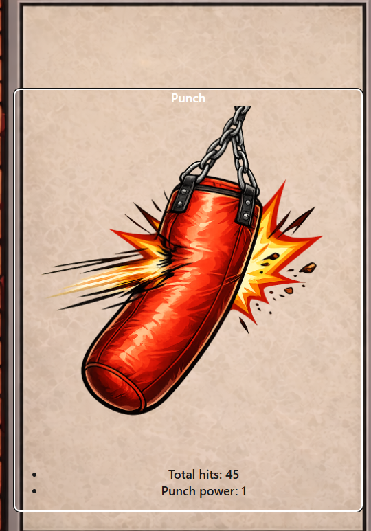
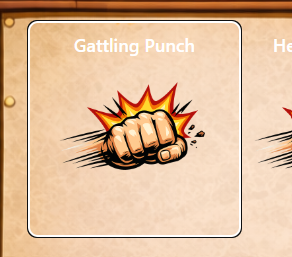
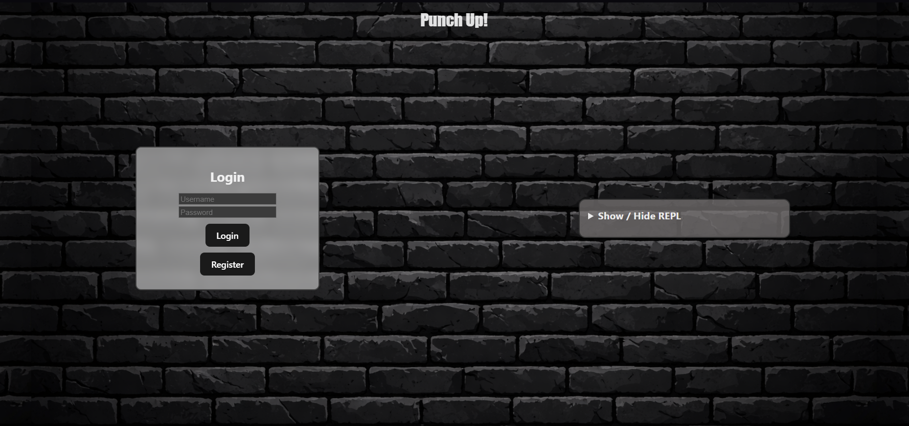
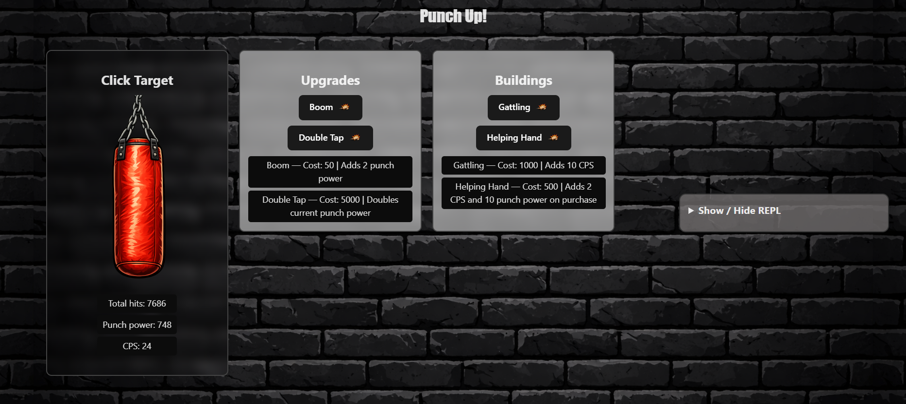
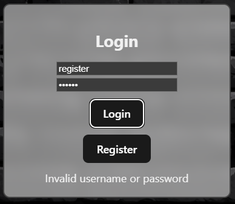
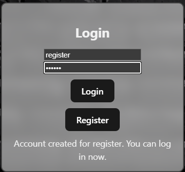

# UI-Assessment

---
**Title** : Assessment for my clicker game 'Punch up' 
**Author**  : Prabhraj Singh Mudharh (mudharps@myumanitoba.ca) - 8012189  
**Date** : Winter 2026
---

## Phase 1

### Visibility

My initial implmentation was pretty minimal due to fact we were following mvp at that time.
* :+1:  Only have the 1 state (actual clicking screen) which is visible at all times. Not exactly a change in state but a change can be observed immidietly when any of the buttons is clicked by the change in values displaced under the bag.
* :+1: All available options visible on the screen
* :-1: Not clear what the objective is. No title, punch written very small
* :-1:  Upgrades might not be fully clear as items to buy, photo is good but not enough to assume as a button.

### Feedback
 

My initial implementation had some feedback.

* :+1: clicking on the bag changes image hence it is clear that it has been clicked.
* :+1: clicking on target and upgrades changes value under the bag, implying something has happened.
* :-1: However upon clicking the upgrades there is no real feed back nothing pops up, the button does not show it has been clicked other than a border surrounding it(could be just hovering or something else not entirely clear to the user). 

### Consistency

Even though it might not look good or be very clear but it is somewhat consistence.
* All buttons are labeled similarly and have text on top describing what they are.
* All buttons are images and have same style of text below them

## Phase 2

Here is the biggest addition to my project, the Login screen.  
  
Here is the updated Main screen 

### Changes
The main change in phase 2 was the addition of Accounts and login screen. Users now need to create an account in order to play the game which also saves their game progress

### Visibility

* :+1: All available options are clearly present on screen. Login screen shows the input fields along with login/register buttons.
* :+1: Main screen is now more clear than before, with clearer instructions. Click target says what to do, and all things are seperated for clarity.
* :-1: Unavailble options are not disabled atleast not visually. Having them of a different color like darked out would help with it.
* :-1: Could add another instruction as "buy items".

### Feedback

 

* :+1: login feedback is good, tells if entered password or username is correct and informs when account is created.
* :-1: upgrade and building buttons do not on their own tell if purchase is successful or not, need to look at change in powers
* :-1: The failed login could be of a different colour(red) and the message could be clearer and more precise for each failed scenario

### Consistency

* :+1: Everything is consistent, all the buttons are of the same type, enclosed in a box with labels.
* :+1: Discription is good and also consistence througout.

### How I might change my UI

The main thing would be to improve on everything mentioned above. Adding clear messages which pop up would be a good thing to tell when a purchase was succesfull and applied. Changing the image of the button like the bag could also be a good way to inform user.

